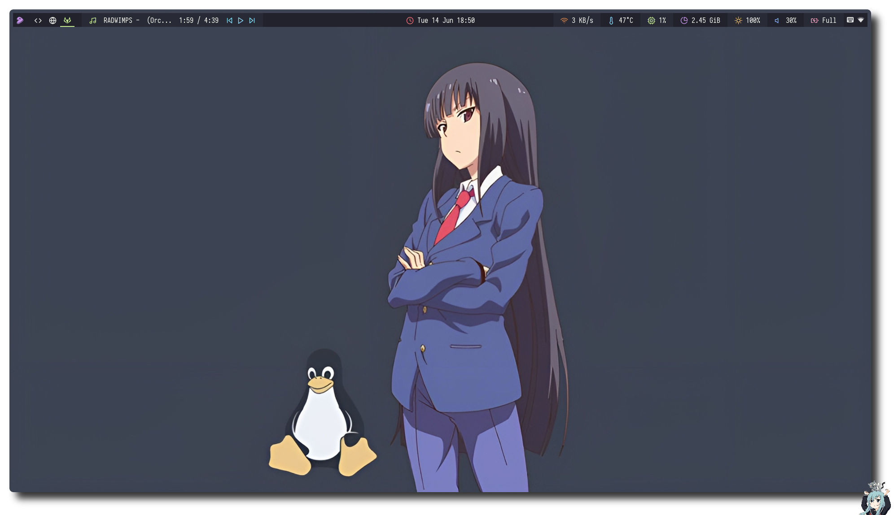
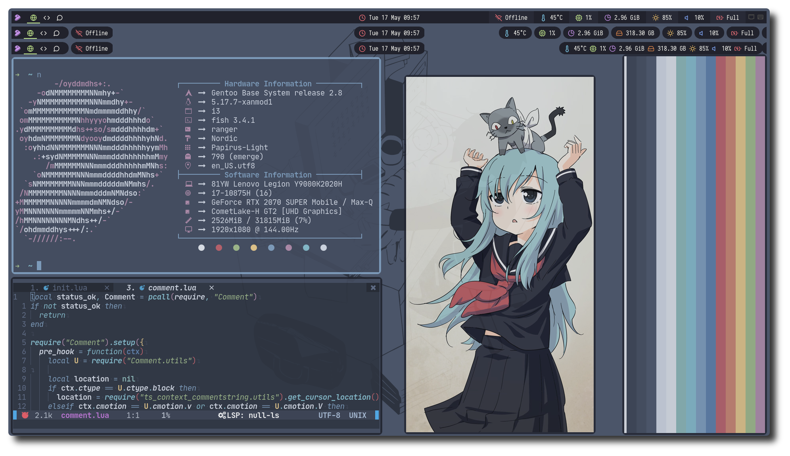
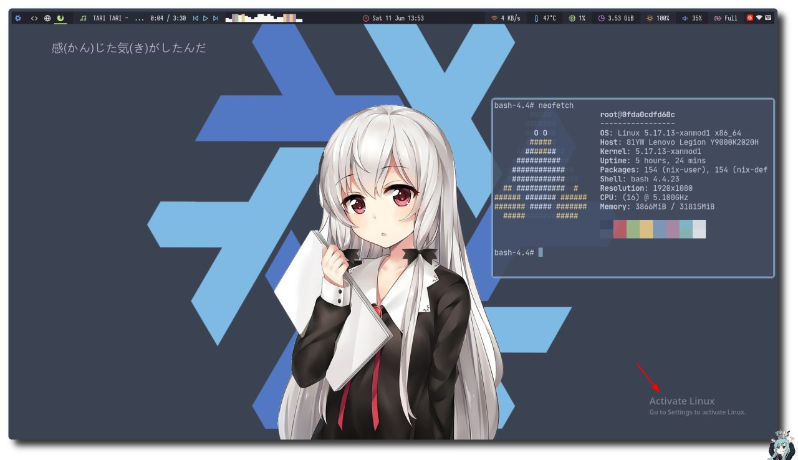
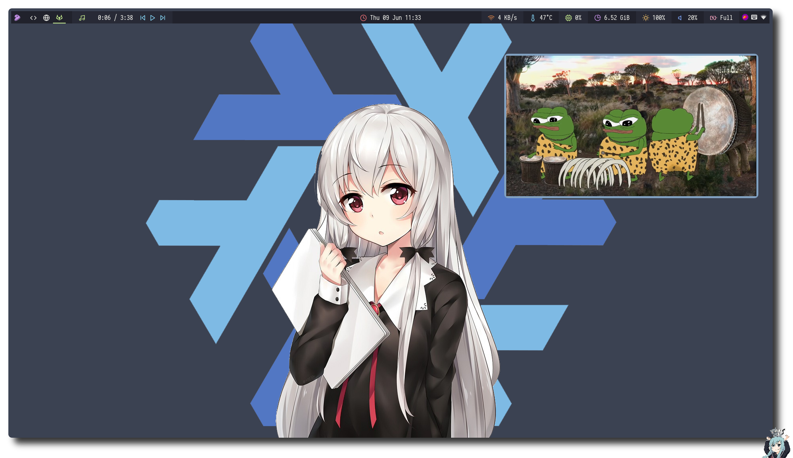

### how to use my dotfiles?

- 😀I use [chezmoi](https://github.com/twpayne/chezmoi) to manager my dotfiles! （Provided you have to download it）。Please use the following command to use my dotfiles.(**Please back up your files before overwriting**)
```bash
$ chezmoi init --apply https://github.com/Ruixi-rebirth/i3-dotfiles.git
```
- Of course, you can also clone the repository directly and choose the configuration you need.
```bash
$ git clone https://github.com/Ruixi-rebirth/i3-dotfiles.git
```

### Shot


<hr>



<hr>



<hr>



<hr>




<hr>
https://user-images.githubusercontent.com/75824585/172759404-4a964beb-e634-4719-aa6e-a892efcf1244.mp4

