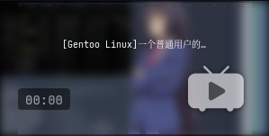

<h1 align="center">Gentoo  Linux</h2>

### how to use my dotfiles?

- 😀I use [chezmoi](https://github.com/twpayne/chezmoi) to manager my dotfiles! （Provided you have to download it）。Please use the following command to use my dotfiles.(**Please back up your files before overwriting**)
```bash
$ chezmoi init --apply https://github.com/Ruixi-rebirth/i3-dotfiles.git
```
- Of course, you can also clone the repository directly and choose the configuration you need.
```bash
$ git clone https://github.com/Ruixi-rebirth/i3-dotfiles.git
```

### Video

[](https://www.bilibili.com/video/BV1SW4y1k7JA?vd_source=c4f02f0c890cb2be8edb56aa53774e09)

### Shot


<details>
<summary style="font-size:1.25em;"><b>Load more</b> <span style="font-size:14px;">(Click to expend) </span> </summary>


</details>


<hr>

https://user-images.githubusercontent.com/75824585/172759404-4a964beb-e634-4719-aa6e-a892efcf1244.mp4

