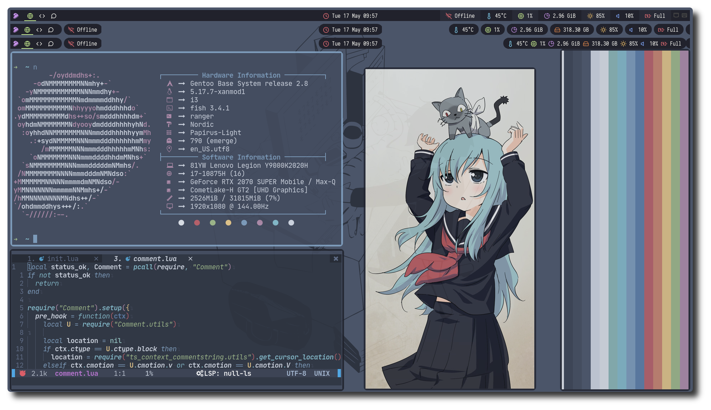

### how to use my dotfiles?

😀I use [chezmoi](https://github.com/twpayne/chezmoi) to manager my dotfiles! （Provided you have to download it）。Please use the following command to use my dotfiles
```bash
$ chezmoi init --apply https://github.com/Ruixi-rebirth/i3-dotfiles.git
```

### Shot


